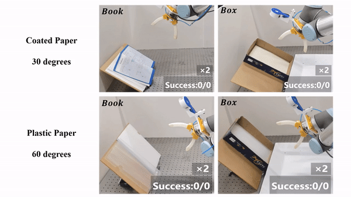

# Flipbot: Learn Continuous Paper Flipping via Coarse-to-Fine Exteroceptive-Proprioceptive Exploration


## 1. Overview
In this work, we propose a learning-based method for manipulating paper-like deformable objects.

**Full book flipping**

<p align = "center">
 
</p>

**Emptying paper-box**

<p align = "center">
 
</p>

**Flipping with different tilted angles**

<p align = "center">
 
</p>


## 2. Prerequisites
### 2.1 Hardware
- [**Universal Robot UR10**](https://www.universal-robots.com/products/ur10-robot/)
- [**RealSense Camera L515**](https://www.intelrealsense.com/lidar-camera-l515/)

### 2.2 Software
The code is built with Python 3.6. Dependencies are listed in requirements.yaml and can be installed via [Anaconda](https://www.anaconda.com/) by running:

    conda env create -n new_env -f environment.yml
    
## 3. Learning in Real-world

You can start learning grasping policy by running following code:
```
python policy_train_rl.py
```

## 5.1 Test on Real Robot (UR10)
Here we provide the steps to test our method on a real robot.

**Robot control**

Robot is controlled via [this python software](https://github.com/SintefManufacturing/python-urx).

**Camera setup**

To deploy RealSense L515 camera,
Download and install the [librealsense SDK 2.0](https://github.com/IntelRealSense/librealsense)

**Start testing**

Then run the following code to start testing:
```
python test_in_real.py
```
if use ft:
1. self.use_ft = True, self.hardcode = False 
2. python rl_train.py --play-only --model=with_ft_final.zip

if without ft:
1. self.use_ft = False, self.hardcode = False
2. python rl_train.py --play-only --model=noft.zip

if flex:
1. self.use_ft = False, self.flex= True
2. python rl_train.py --play-only

## Maintenance 
For any technical issues, please contact: Chao Zhao (czhaobb@connect.ust.hk).
